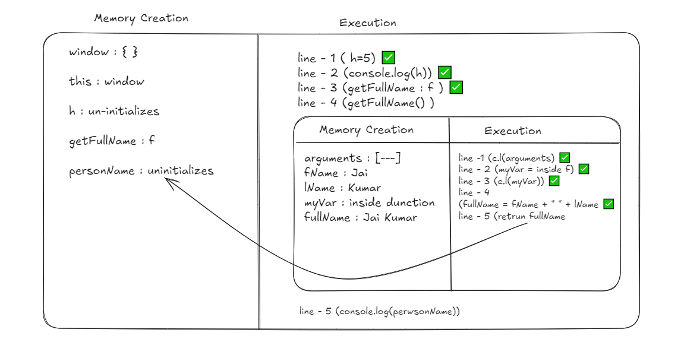

# How JavaScript Works
JavaScript is Syncronous, Single-threaded language.

### JS works on two phases:
- Compilation phase
    - tokenizing / lexing : breaking the code into small pieces called tokens
    - parsing : converting tokens into a tree called Abstract Syntax Tree (AST)
    - code generation : converting AST into machine code
- Execution phase
    - In JS, code executes inside an `Execution Context` which has two phases:
        - Creation phase
            - Creation of the `Variable Object` (VO)
            - Creation of the `Scope Chain`
            - Determination of the value of `this`
        - Execution phase
            - Execution of the code line by line

```javascript
console.log(this);  // line-1
console.log(window);// line-2
console.log(fName); // line-3
var fName = "Jai";  // line-4
console.log(fName); // line-5
```
    |   1. Memory Creation Phase    |   2. Execution Phase          |
    | --- | --- |
    |   window : {}                 |    line-1 (window Object)     |
    |   this : window               |    line-2 (window Object)     |
    |   fName : undefined           |    line-3 (undefined)         |
    |   fName : "Jai"               |    line-4 executed            |
    |                               |    line-5 (Jai)               |

- When Global Execution Context is created, it has `this` pointing to `window` object.
- In the creation phase, `Variable Object` is created and all the variables are set to `undefined`.
- In the execution phase, the code is executed `line by line`.
- During the compilation phase JS knows about the variables and functions but not their values.

## Hoisting
- Before the execution phase, all the varialbes and functions ara `stored` in memory. During the `Global Execution Creation`, these variables have been created but not initialized. This is called `Hoisting`.

- During Global Execution Cintext Creation, all functions declarations are stored in memory. But function expressions are not hoisted.

- In case of `let` and `const`, they are hoisted but not initialized. Period of `un-initialized` variable is known as **`Temporal Dead Zone`**.

## Global Scope
- It is the scope of the global object. In the browser, it is the window object. 
- In Node.js, it is the global object.

## Lexical Scope
- It is the scope of the function defined at the time of the definition. 
- It is fixed and does not change.


## function execution context
- When a function is called, a new `Execution Context` is created.
- It has its own `Variable Object`, `Scope Chain` and `this`.
- It is pushed to the top of the `Execution Stack`.
- When the function is executed, it is popped out of the stack.

```javascript
let h = 10;
console.log(h); // 10
function getFullName(fName, lName){
    console.log(arguments);
    let myVar = "inside function";
    console.log(myVar);
    const fullName = fName + " " + lName;
    return fullName;
}
const name = getFullName("Jai", "Kumar");
console.log(name);
```

